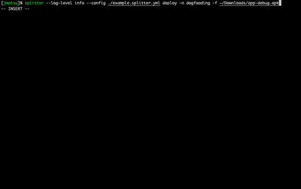

# splitter

A command to deploy your apps to several mobile app distribution services. The motivation of splitter is to encourage Mobile App Deployment as Code. 

```shell
// for internal dogfooding
splitter deploy -f path/to/aab -n dogfooding

// for pull request
splitter deploy -f path/to/aab -n pull-request

// for design reviews
splitter deploy -f path/to/aab -n design-review
```



## Install

Download the latest binary from GitHub Release.

## Configuration-based deployment

splitter allows you to manage deployment configuration as Code. This feature makes you focus on *defining* deployments.

```text
USAGE:
   splitter deploy [command options] [arguments...]

OPTIONS:
   --name value, -n value         deployment name in your configuration file. [$SPLITTER_DEPLOYMENT_NAME]
   --source-path value, -f value  A path to an app file.
   --release-note value           An release note of this revision. Some of services may not support this option. [$SPLITTER_DEPLOYMENT_RELEASE_NOTE]
```

### Syntax

### DeployGate configuration

**Required**

- `app-owner-name`
- `api-token`

https://github.com/jmatsu/splitter/blob/main/internal/config/deploygate_config.go

#### Firebase App Distribution configuration

**Required**

- `app-id`
- `access-token` or `credentials-path`

https://github.com/jmatsu/splitter/blob/main/internal/config/firebase_app_distribution_config.go

#### Local configuration

**Required**

- `destination-path`

https://github.com/jmatsu/splitter/blob/main/internal/config/local_config.go

### Pre-/Post-Steps

You can define pre-steps that will be executed before the deployment and post-steps that will be executed after the successful deployment. 

**Limitation**

- Non-zero status will halt the following steps and deployment.
- Every step will be executed on different shells so variables are not inherited to other steps.

## On-demand deployment

splitter provides commands specified for deployment to each service. This mode doesn't use `deployments` configuration in the config file.

These commands may accept finer-grained options than the configuration-based command.

### DeployGate - https://deploygate.com/

The minimum behaviour just creates new releases, but you can create and/or [Distribution](https://intercom.help/deploygate/en/articles/4536501-what-is-distribution-page).

```text
USAGE:
   splitter deploygate [command options] [arguments...]

OPTIONS:
   --app-owner-name value, -n value   User name or Organization name. [$DEPLOYGATE_APP_OWNER_NAME]
   --api-token value, -t value        The api token of the app owner. [$DEPLOYGATE_API_TOKEN]
   --source-path value, -f value      A path to an app file.
   --message value, -m value          A short message of this revision.
   --distribution-access-key value    An access key of a distribution that must exist. If the both of key and name are specified, key takes priority.
   --distribution-name value          An name (title) of a distribution that does not have to exist. If the both of key and name are specified, key takes priority.
   --distribution-release-note value  An release note of this revision that will be available only while being distributed via the specified distribution.
   --disable-ios-notification         Specify this file if you would like to disable notifications for iOS. (default: false)
```

### Firebase App Distribution - https://firebase.google.com/docs/app-distribution

The minimum behaviour just creates new releases, but you can update release notes and distribute to specific groups.

```text
USAGE:
   splitter firebase-app-distribution [command options] [arguments...]

OPTIONS:
   --app-id value                  Firebase App ID. e.g. 1:123456578:android:xxxxxxx [$FIREBASE_APP_ID]
   --source-path value, -f value   A path to an app file.
   --access-token value, -t value  The access token to use for this distribution. [$FIREBASE_CLI_TOKEN]
   --credentials value             A path to a credentials json file.
   --release-note value            An release note of this revision.
   --group-aliases value           Aliases of groups. Separate multiple aliases by commas.
   --tester-emails value           Emails of testers. Separate multiple aliases by commas.
```

> To get your access token, we recommend https://github.com/google/oauth2l.

### Local

Your local file system.

```text
USAGE:
   splitter local [command options] [arguments...]

OPTIONS:
   --source-path value, -f value       A source path to an app file.
   --destination-path value            A destination path to an app file.
   --delete-source                     Specify true if you would not like to keep the source file. (default: false)
   --overwrite                         Specify true if you allow to overwrite the existing destination file. (default: false)
   --file-mode value                   The final file permission of the destination path. (default: Same to the source)
```

## About the supported services 

- DeployGate - https://deploygate.com/
- Firebase App Distribution - https://firebase.google.com/docs/app-distribution
- Local - Your local file system.

## LICENSE

splitter is licensed under the Apache License, Version 2.0. See [LICENSE](LICENSE) for the full license text.